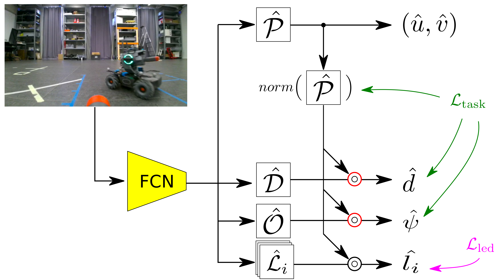
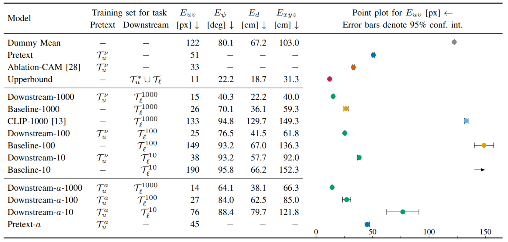

# Learning to Estimate the Pose of a Peer Robot in a Camera Image by Predicting the States of its LEDs
[[Paper]](https://github.com/idsia-robotics/ssl-pretext-multi-led) [[Video]](https://drive.switch.ch/index.php/s/i5g6ktTii6Xil3L) [[Training Dataset]](https://drive.switch.ch/index.php/s/Ck05KNJcblCUaXd) [[Validation Dataset]](https://drive.switch.ch/index.php/s/i7fUIk1mhIIHpbs) [[Testing Dataset]](https://drive.switch.ch/index.php/s/wSUQrmhJZWoJC4F) 

_Nicholas Carlotti, Mirko Nava, and Alessandro Giusti_

Dalle Molle Institute for Artificial Intelligence, USI-SUPSI, Lugano (Switzerland)



Figure 2: Our fully convolutional network model takes an image as input and predicts maps for the robot's image space position $\hat{P}$, distance $\hat{D}$, orientation $\hat{O}$ and state of the LEDs $\hat{L}_i$. We obtain scalar values from the maps by element-wise multiplication (denoted as $\circ$) with $norm(\hat{P})$, acting as an attention mechanism. By optimizing $\hat{l}_i$, the model learns to estimate the robot's LED state and position in the image; gradients for $\hat{P}$ resulting from the optimization of $\hat{d}$ and $\hat{\psi}$ are blocked (see Section III-A for details).

## Abstract
We consider the problem of training a fully convolutional network to estimate the relative 6D pose of a robot given a camera image, when the robot is equipped with independent controllable LEDs placed in different parts of its body.  The training data is composed by few (or zero) images labeled with a ground truth relative pose and many images labeled only with the true state (`on` or `off`) of each of the peer LEDs.  The former data is expensive to acquire, requiring external infrastructure for tracking the two robots; the latter is cheap as it can be acquired by two unsupervised robots moving randomly and toggling their LEDs while sharing the true LED states via radio.

Training with the latter dataset on estimating the LEDs' state of the peer robot (_pretext task_) promotes learning the relative localization task (_end task_).

Experiments on real-world data acquired by two autonomous wheeled robots show that a model trained only on the pretext task successfully learns to localize a peer robot on the image plane; fine-tuning such model on the end task with few labeled images yields statistically significant improvements in 6D relative pose estimation with respect to baselines that do not use pretext-task pre-training, and alternative approaches. 
Estimating the state of multiple independent LEDs promotes learning to estimate relative heading.
The approach works even when a large fraction of training images do not include the peer robot and generalizes well to unseen environments.



Table 1: Model's median error on 2D position $uv$, heading $\psi$, distance $d$, and 3D position $xyz$ averaged on four replicas per row.

## How to run

### Requirements
Requirements are listed in the `requirements.txt` file. To install them, simply run:

```bash
python3 -m pip install requirements.txt
```


### Dashboard
To monitor the model's training process and metrics, we use mlflow. The dashboard is served on [localhost](http://localhost:5000/). To run it, execute the following:

```bash
bash start_mlflow_ui.bash
```

Model checkpoints are saved on the run's artifacts page.

### Training
To train the __pretext__ model run:

```bash
python3 -m training \
    --experiment-id 0 \
    --run-name pretext_model \
    --model-type model_s_wide \
    --task pretext \
    --dataset data/four_leds_training.h5 \
    --validation-dataset data/four_leds_validation.h5 \
    --device {YOUR_DEVICE} \
    --epochs 100 \
    --learning-rate 0.002 \
    --w-led 1. \
    --w-proj 0. \
    --w-dist 0. \
    --w-ori 0. \
    --labeled-count 0 \
    --visible # Remove this if you want to train also on non-visible-robot images 
```
To train the __downstream__ model, the scripts assume that a pretext checkpoint is available in a past mlflow run with the name `{PRETEXT_RUN_NAME}`. To train a downsteram model with 1000 labeled samples, run:

```bash
python3 -m training
    --experiment-id 0
    --run-name downstream_model
    --weights-run-name {PRETEXT_RUN_NAME}
    --checkpoint-id 99
    --model-type model_s_wide
    --task downstream
    --dataset data/four_leds_training.h5
    --validation-dataset data/four_leds_validation.h5
    --device {YOUR_DEVICE}
    --epochs 100
    --learning-rate 0.002
    --w-led 1.
    --w-proj 0.3
    --w-dist 0.3
    --w-ori 0.3
    --sample-count 1000
    --sample-count-seed 0
    --visible
```

To train the __baseline__ model, run:
```bash
python3 -m training
    --experiment-id 0
    --run-name baseline_model
    --model-type model_s_wide
    --task downstream
    --dataset data/four_leds_training.h5
    --validation-dataset data/four_leds_validation.h5
    --device {YOUR_DEVICE}
    --epochs 100
    --learning-rate 0.002
    --w-led 0.
    --w-proj 0.3
    --w-dist 0.3
    --w-ori 0.3
    --sample-count 1000
    --sample-count-seed 0
    --visible
```

### Testing
To test a checkpoint from a mlflow run, execute:

```bash
python3 -m testing
    --experiment-id 0
    --device {YOUR_DEVICE}
    --dataset data/four_leds_testing.h5
    --run-name {RUN_NAME}
    --checkpoint-id 99
    --task {MODEL_TASK}
    --visible

```

To obtain raw inference data from the testing process, add the `--inference-dump {FILENAME}.pkl` to the previous command.
